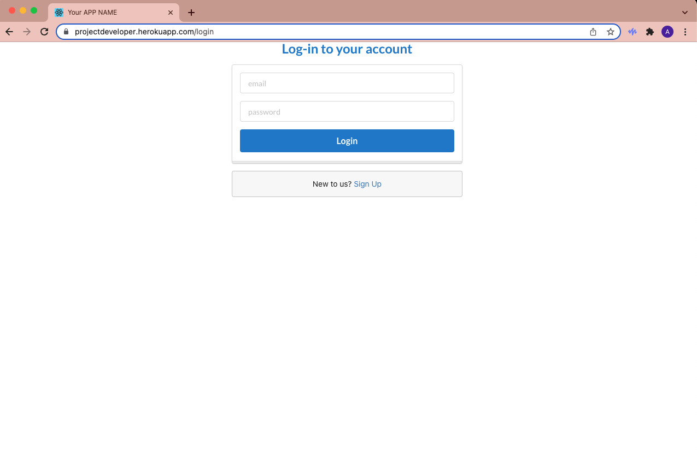
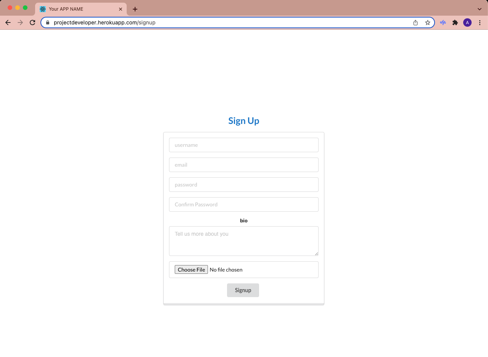
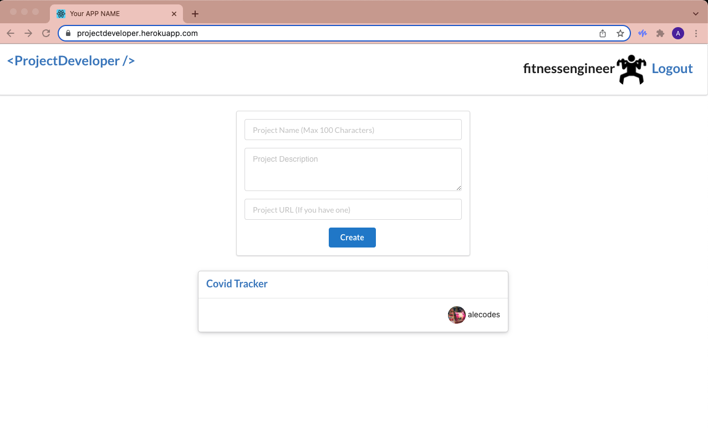
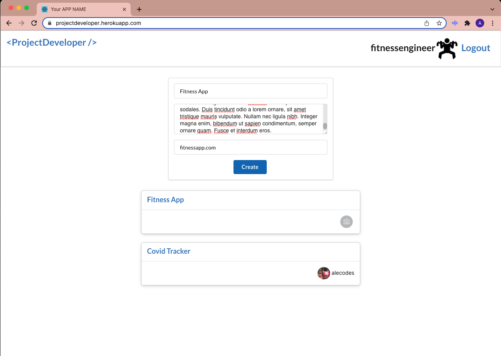
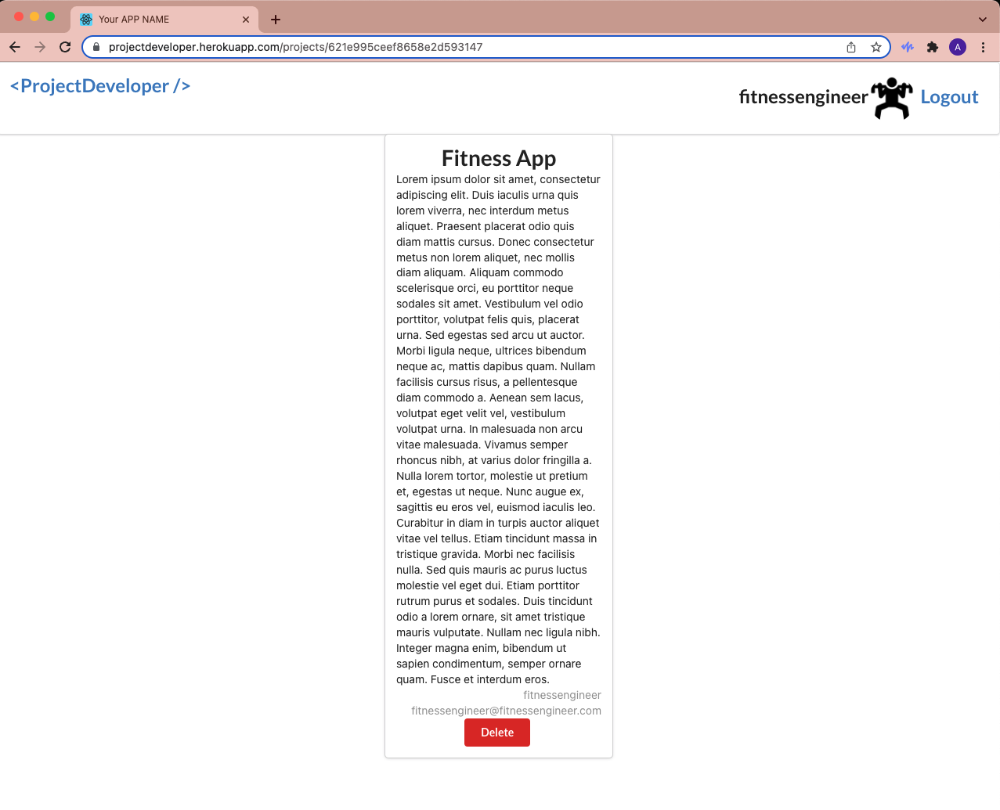
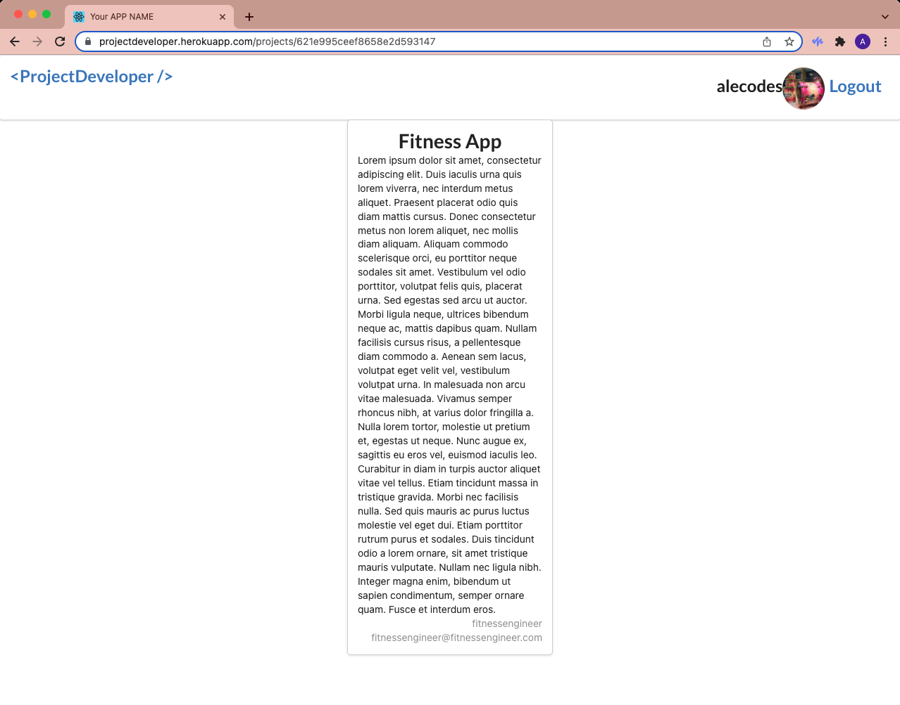

# ProjectDev

The goal of ProjectDev is to be a Craigslist for web developers. Once a user in signed up or logged in, they may browse a list
of projects posted by other developers. Projects can range from a small mobile app to large web apps. Users can find a project they are interested in and email the user who submitted the project. A user can also post a project they want help with.

## Screenshots

## Technologies Used

- ReactJS
- ExpressJS
- MongoDB
- Node
- Semantic UI

## Getting Started

[Go To ProjectDeveloper](https://projectdeveloper.herokuapp.com/)

## Trello

[Trello Board](https://trello.com/b/NBWXy5iY/project-4)

## IceBox

- Profile pages for users
- Search through existing projects
- Sort through existing projects (mobile app, web app, games, portfolios)
